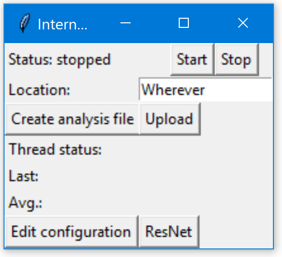

[Back to main page](index.html)

# Table of contents

1. [Getting Started](# Getting Started)  
    1.1 [Downloads](# Downloads)  
    1.2 [Running](# Running)  
2. [Basic Usage](# Basic Usage)  
    2.1 [Running Speed Tests](##Running-Speed-Tests)
    2.2 [Uploading Results](## Uploading results)
    2.3 [The ResNet Button](## The ResNet Button)
    2.4 [Create Analysis File Button](##Create-Analysis-File-Button)

# Getting Started

## Downloads

First, I would recommend downloading the program.  That typically makes it a bit easier to run.  Download it on [this page](downloads).

For Windows, you should download the `.exe` file.  For OSx/Linux, you can download the source tarball in either `.tar.gz` or `.zip`, whichever is easier for you.  On Linux, that is probably `.tar.gz`; on OSx, I have no idea (if you do, please let me know.  I only have access to a Windows laptop).

## Running

On Windows, simply double-click the `.exe` file you downloaded.  It will automatically create a file called `config.ini` containing various configuration details; ignore this unless you want to change your default preferences.

On OSx/Linux, which come by default with Python, navigate to the downloaded source and unzip it.  To unzip a tarball, run `tar xf [name_of_downloaded_file].tar.gz`.  To unzip the `.zip` file, run `tar xvf [name_of_downloaded_file].zip`.  Then navigate to the directory and run `python gui.py &` (make sure to use Python 3 -- if you have both 2 and 3 on your system, run `python3 gui.py &`.  If you don't know what this means, do just plain python.  
I'm working on a more accessible system for Macs, but don't have one, so it might be a while.

# Basic Usage

## Running Speed Tests

In order to run speed tests, first, run the program as [described above](## Running), and the little window should pop up.  To start recording the internet speed (which you want to do), click the button that says "Start".

Before you do this, however, enter in the Location field where you are.  This *really* helps me sort through the data and make it useful -- I can't very well tell ResNet that the network speeds are slow in "McVey", but I can tell them it's slow in "McVey 3rd north".  This is surprisingly important.

When you no longer want to run speed tests, click the button that says "Stop".

## Uploading results

***PLEASE PLEASE PLEASE***, when you're done, click the upload button.  That button sends the data you recorded to my computer, which stores it for future analysis.  I can't do anything if I don't get the data you've been collecting.

After the results have been uploaded, they are cleared from your computer.  The main reason for this is to prevent duplicate data -- if, every time you upload data, you upload the same data + a bit more, I will rapidly accumulate vast amounts of identical data that becomes very difficult to filter out.  

## The ResNet Button

Pressing the ResNet button brings you to ResNet's support ticket page.  The sole purpose of this button is because I can never find this page and frequently want to submit tickets when the internet isn't working.  Please don't flood ResNet with tickets for slow internet -- they know about this -- but if it goes down, then let them know.

## Create Analysis File Button

This button creates a summary file based on your current results.  It
[writes a summary to the file](https://github.com/mishaturnbull/PySpeedTest/issues/3)
[specified in the configuration](https://github.com/mishaturnbull/PySpeedTest/issues/5)
without removing the results.  The only gotcha with this feature is that it must be done before uploading: for various reasons, uploading the results clears them from your machine.

[downloads]: github.com/mishaturnbull/PySpeedTest/releases/latest